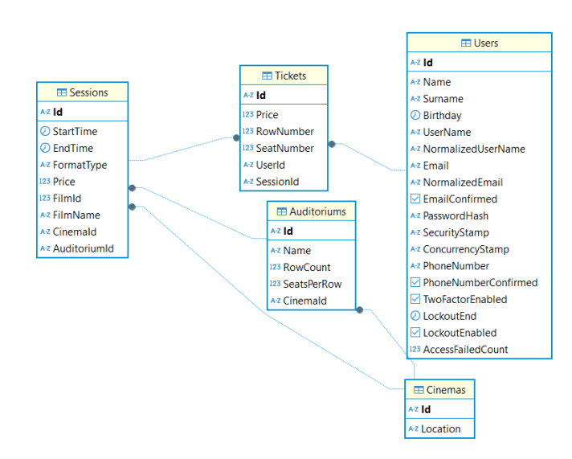
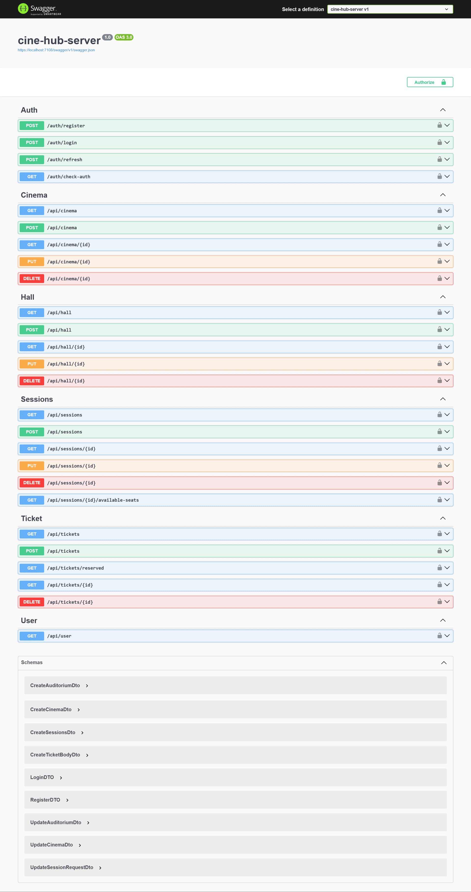
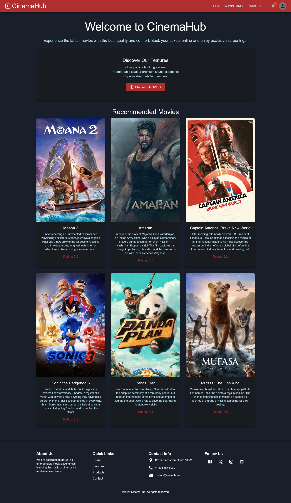
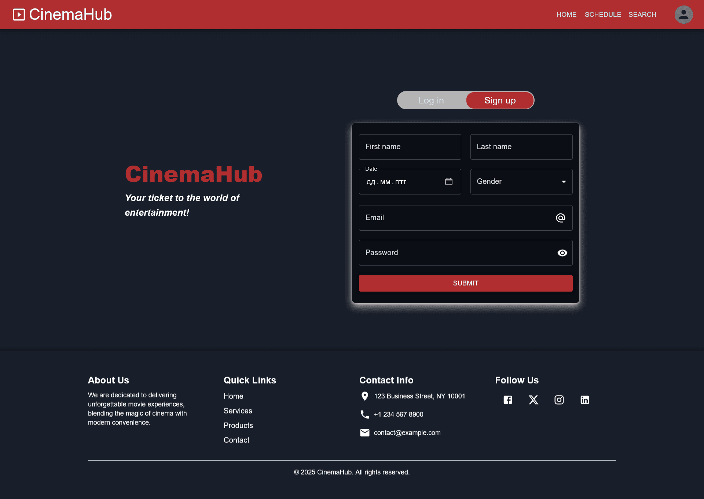
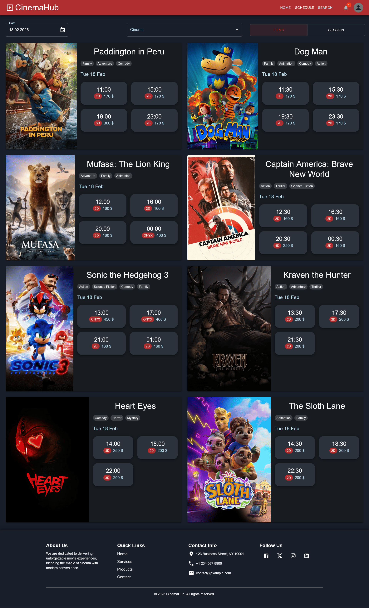
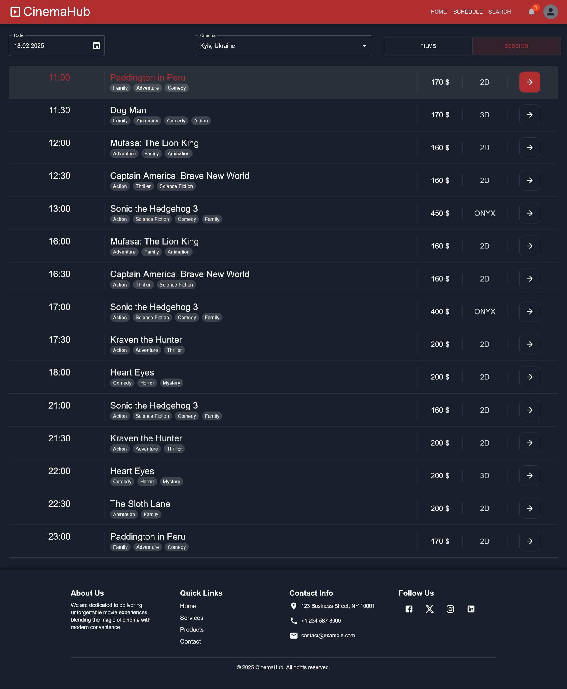
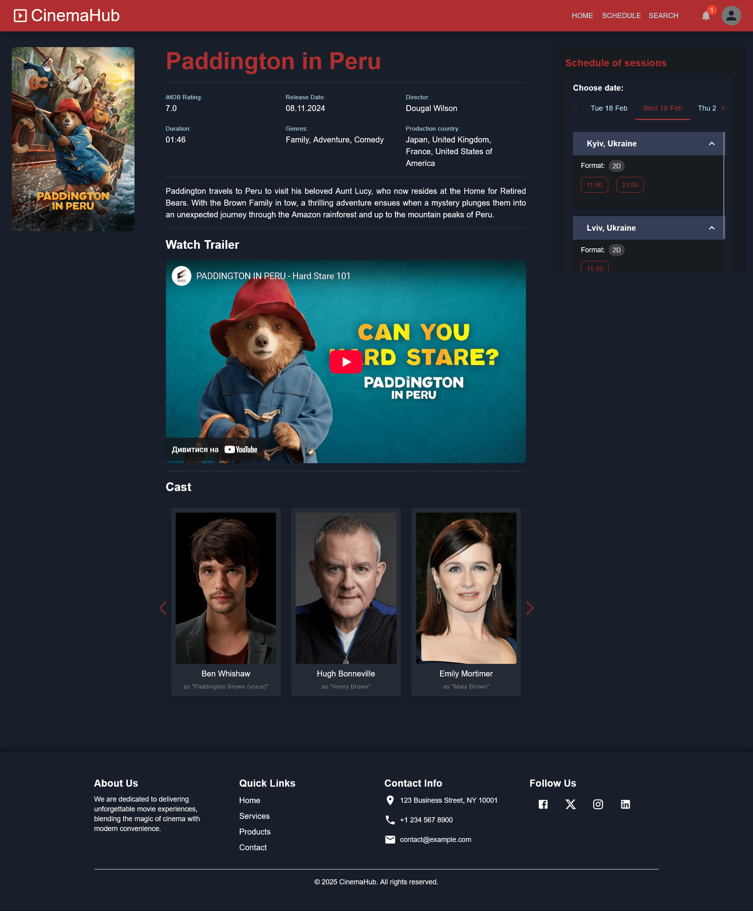
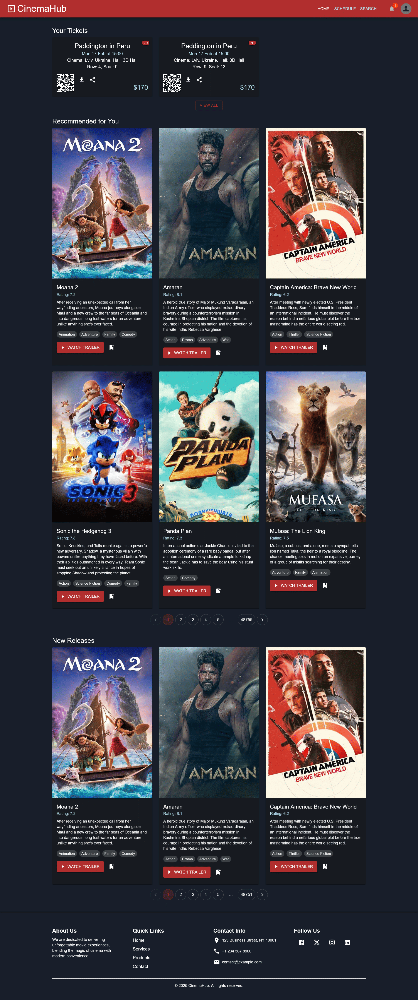
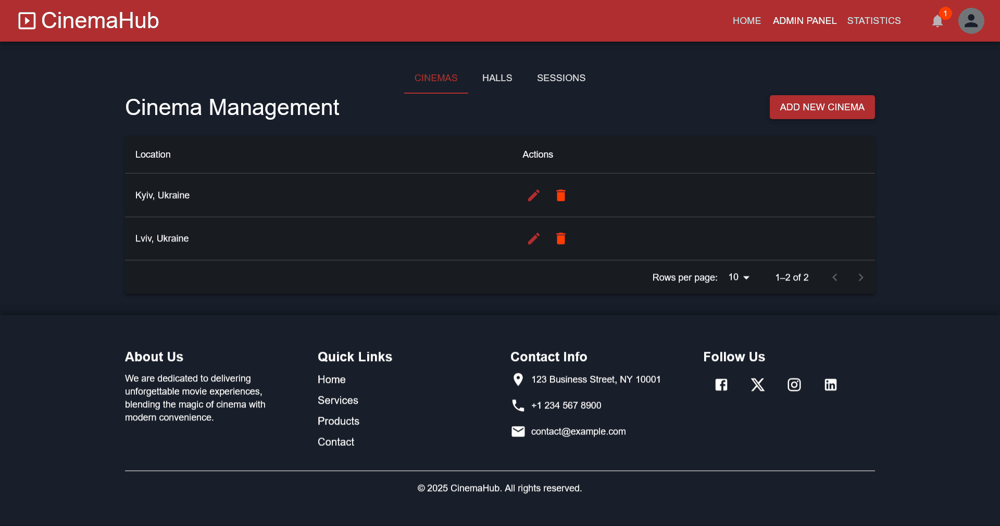
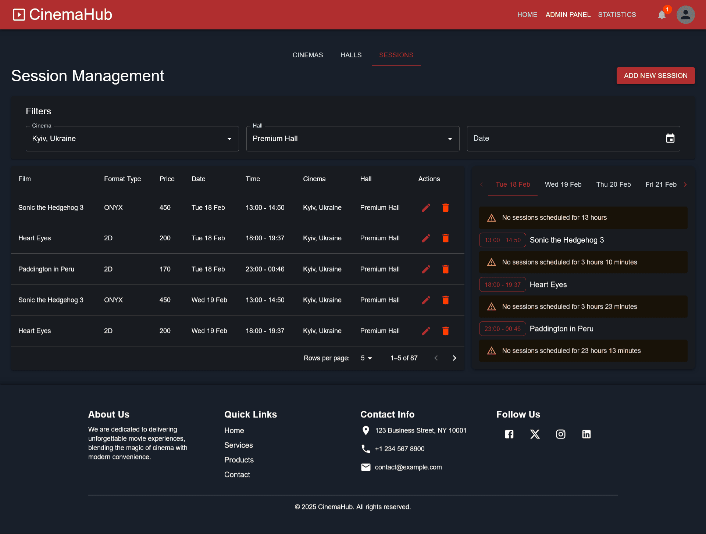

# Full Stack Cinema Application

## About the project

The project is a web application for managing the activities of a cinema, designed for two main groups of users - administrator and client. The system provides admins with convenient management of films, sessions and ticket prices, the ability to view sales statistics, various metrics, etc., and for ordinary users, the ability to view the schedule of sessions of current films, buy tickets, view detailed information about films, etc.
[Backend] (#backend) was built with ASP.NET Core that provides functionality for managing a cinema ticket booking system. It follows a three-tier architecture and interacts with a PostgreSQL database.
[Frontend] (#frontend) was built with Vite, React, TypeScript, MUI, Redux Toolkit.

[Backend](#backend)
[Frontend](#frontend)

# Backend

## Table of Contents

- [Technologies Used](#technologies-used)
- [Project Structure](#project-structure)
- [API Endpoints](#api-endpoints)
- [Pagination Format](#pagination-format)
- [Database Schema](#database-schema)
- [Swagger Documentation](#swagger-documentation)
- [Configuration](#configuration)
- [Admin Credentials](#admin-credentials)
- [Running the Project](#running-the-project)

## Technologies Used

- **ASP.NET Core Web API**
- **PostgreSQL**
- **JWT Authentication**
- **Swagger for API documentation**
- **EF Core for database access**
- **Repository & Service Pattern**

## Project Structure

```
cine-hub-server/
├── Controllers/        # API controllers handling HTTP requests
├── Data_access/        # Database context, seed data, and migration management
│   ├── CineDbContext.cs  # Database context class for EF Core
│   ├── SeedData.cs       # Functions for populating the database with initial data
├── DTOs/              # Data Transfer Objects for request/response models
├── Exceptions/        # Custom exception handling classes
├── Helpers/           # Utility classes for various helper functions
├── Interfaces/        # Interface definitions for repositories and services
├── Migrations/        # Entity Framework migrations for database schema changes
├── Models/            # Entity models representing database tables
├── Repositories/      # Data access layer handling database operations
├── Services/          # Business logic layer containing application services
├── appsettings.json   # Application configuration file
├── Program.cs         # Main entry point of the application
```

## API Endpoints

### **AuthController**

Handles authentication and authorization.

- `POST /auth/login` - User login
- `POST /auth/register` - User registration
- `POST /auth/refresh` - Refresh JWT token
- `GET /auth/check-auth` - Check authentication status

### **UserController**

- `GET /user/` - Get user details

### **CinemaController**

Manages cinema entities.

- `GET /cinemas` - Get paginated list of cinemas
- `GET /cinemas/{id}` - Get cinema by ID
- `POST /cinemas` - Create a new cinema
- `PUT /cinemas/{id}` - Update cinema details
- `DELETE /cinemas/{id}` - Delete a cinema

### **HallController**

Manages cinema halls.

- `GET /halls` - Get paginated list of halls
- `GET /halls/{id}` - Get hall by ID
- `POST /halls` - Create a new hall
- `PUT /halls/{id}` - Update hall details
- `DELETE /halls/{id}` - Delete a hall

### **SessionsController**

Manages movie sessions.

- `GET /sessions` - Get paginated list of sessions
- `GET /sessions/{id}` - Get session by ID
- `POST /sessions` - Create a new session
- `PUT /sessions/{id}` - Update session details
- `DELETE /sessions/{id}` - Delete a session

### **TicketController**

Manages ticket bookings.

- `GET /tickets` - Get paginated list of tickets
- `GET /tickets/{id}` - Get ticket by ID
- `POST /tickets` - Book a ticket
- `DELETE /tickets/{id}` - Cancel a ticket

## Pagination Format

Each paginated API response includes:

```json
{
  "total_pages": 10,
  "total_results": 100,
  "page": 1,
  "results": []
}
```

## Database Schema



## Swagger Documentation



## Configuration

### **appsettings.json**

```json
{
  "Logging": {
    "LogLevel": {
      "Default": "Information",
      "Microsoft.AspNetCore": "Warning"
    }
  },
  "AllowedHosts": "*",
  "ConnectionStrings": {
    "WebApiDatabase": "Host=localhost; Database=CineHubDB; Username=<your_db_username>; Password=<your_db_password>"
  },
  "JwtOptions": {
    "Key": "<your_secret_key>",
    "AccessLifetime": 60,
    "RefreshLifetime": 10080,
    "Issuer": "<your_issuer>"
  },
  "AllowedOrigins": ["<your_frontend_domen>"],
  "AdminCredentials": {
    "Password": "Admin@123"
  }
}
```

## Admin Credentials

Upon database initialization, an admin user is created:

- **Email:** `admin@example.com`
- **Password:** `Admin@123`

## Running the Project

1. Set up PostgreSQL and configure the connection string in `/cineHubBackend/appsettings.json`
2. Apply database migrations:
   ```sh
   cd cineHubBackend
   dotnet ef database update
   ```
3. Run the project:
   ```sh
   dotnet run
   ```
4. Access the API documentation at `http://localhost:7108/swagger` (or `http://localhost:5004/swagger`)

---

# Frontend

## Table of Contents

- [Features](#features)
- [Technology Stack](#technology-stack)
- [Installation](#installation)
- [Environment Variables](#environment-variables)
- [Project Structure](#project-structure)
- [Pages and Functionality](#pages-and-functionality)
- [Theming](#theming)
- [External API Integration](#external-api-integration)

## Features

### Admin:

- CRUD operations for managing movies, cinemas, halls, and showtimes.
- Viewing statistics for planned sessions.

### User:

- Browse current offers and new movie releases.
- View movie schedules with filters (time, date, genre, etc.).
- View detailed movie information (description, trailers, cast, ratings).
- Register and log in to book tickets.
- View booked tickets.

## Technology Stack

- **Frontend:** Vite, React, TypeScript, MUI, Redux Toolkit
- **Backend:** ASP.NET Web API
- **Database:** PostgreSQL
- **External API:** [The Movie Database (TMDb)](https://developer.themoviedb.org/reference/intro/getting-started)

## Installation

1. Install dependencies:
   ```bash
   cd cineHubFrontend
   npm install
   ```
2. Create a `.env` file in the `cineHubFrontend` directory and add the necessary environment variables (see the section below)
3. Start the development server:
   ```bash
   npm run dev
   ```

## Environment Variables

Create a `.env` file in the `cineHubFrontend` directory with the following values:

```
VITE_APP_API_KEY=API_KEY_FOR_THEMOVIEDB
VITE_APP_BASE_URL=https://api.themoviedb.org/3/
VITE_BASE_IMG_URL = https://image.tmdb.org/t/p/
VITE_BASE_URL = https://localhost:7108/
VITE_ACCESS_LIFETIME = 60
VITE_REFRESH_LIFETIME = 10080
```

## Project Structure

```
 cine-hub-front/
 ├── src/
 │   ├── components/   # Reusable components
 │   ├── pages/        # Pages
 │   ├── store/        # Redux store & slices
 │   ├── hooks/        # Custom hooks
 │   ├── models/       # Main interfaces
 │   ├── App.tsx       # Main application file with app routes
 │   ├── main.tsx      # Entry point
 ├── public/           # Static assets
 ├── .env              # Environment variables
 ├── package.json      # Dependencies and scripts
 ├── README.md         # Documentation
```

## Pages and Functionality

### 1. Home Page

- Displays the site’s main functionalities and recommended movies.



### 2. Login & Registration Page

- Allows users to sign in or create an account to book tickets.



### 3. Movie Schedule Page

- Shows available showtimes with filters for date, cinema, and list or schedule view.





### 4. Movie Search Page

- Allows searching for movies by query, year, and country.


### 5. Movie Details Page

- Displays detailed movie information, including showtimes, cast, ratings, and trailers.



### 6. Ticket Booking Page

- Enables users to book tickets for a selected movie session.


### 7. User Dashboard

- Displays booked tickets, recommended movies, and new releases.



### 8. Tickets Page

- Shows a list of booked tickets.

### 9. Admin Dashboard

- Provides an overview of planned sessions and statistics, with filters for cinema, hall, and date.


### 10. Admin Panel

- Includes tabs for managing cinemas, halls, and showtimes (CRUD operations).






### 11. Statistics Page (In Progress)

- Will display statistical insights about the cinema’s operations.


## Theming

The project supports both dark and light themes. Users can switch between themes in the settings

## External API Integration

The frontend fetches movie data from **The Movie Database (TMDb)** API to provide up-to-date movie details
